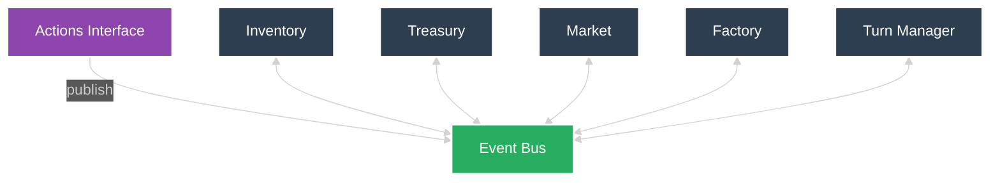

# Module Specifications

> This system is event‑driven; modules communicate exclusively via the event bus.

## Shared Utilities

**validate_action()** – Common validation logic imported by all modules
- Checks resource availability, state constraints, and action feasibility
- Each module implements its own validation rules using this utility

## Inventory
**Description**: Tracks physical resources and production output

**State**: wire, unsold_clips, total_clips

**API**:
- add_wire() - Add wire to inventory
- remove_wire() - Remove wire for production
- add_clips() - Add clips to unsold_clips and total_clips
- remove_clips() - Remove clips from unsold_clips for sale
- get_state() - Return current inventory levels

**Responsibility**: Track raw materials, finished goods inventory, and lifetime production

## Treasury
**Description**: Manages financial resources and transaction tracking

**State**: fund

**API**:
- add_funds() - Increase money from sales
- remove_funds_for_wire() - Decrease money for wire purchase (validate funds)
- remove_funds_for_autoclipper() - Decrease money for autoclipper purchase (validate funds)
- get_state() - Return current money balance

**Responsibility**: Manage financial resources and transaction tracking

## Market
**Description**: Handles pricing logic, demand modeling, and sales transactions

**State**: price, demand_parameters (hidden)

**API**:
- set_price() - Update selling price
- get_state() - Return current price 
- process_sales() - Execute sale: Treasury will add fund, and Inventory will remove clips
- _update_demand() - Modify demand function parameters (Internal)
- _calculate_sales() - Convert price/demand to actual clips sold (Internal)

**Responsibility**: Handle pricing logic, demand modeling, and sales transactions

## Factory
**Description**: Manages automated production capacity and clip manufacturing

**State**: auto_clippers

**API**:
- add_autoclipper() - Increase automated production capacity
- remove_autoclipper() - Decrease capacity (validate not below zero)
- produce_clips() - Generate clips from auto-clippers
- get_state() - Return auto_clipper count 

**Responsibility**: Manage automated production capacity and clip manufacturing

## Turn Manager
**Description**: Centralizes turn sequencing and time-step control.

**State**: turn_counter

**API**:
- run_turn() – Increment turn counter and execute plan and action phases
- get_state() – Return current turn number

**Responsibility**: Coordinate turn progression and enforce turn ordering

## Event Bus
**Description**: Facilitates all inter‑module communication via a Redis-based implementation with thin adapter layer.

**State**: event log

**Functions**:
- publish() – validate and emit to subscribers
- subscribe() – register module for specific events
- get_event_log() – return full event history

**Responsibility**: Centralised, durable event handling for all modules.

**Implementation**: Thin adapter wraps Redis Pub/Sub/Streams, providing event validation, module-specific routing, and failure handling.

## Module Flows

## Detailed System Flow

### Turn Sequence Flow

| Step | Module           | Event Trigger             | Action                           | Event Emitted                | Description                              |
| ---- | ---------------- | ------------------------- | -------------------------------- | ---------------------------- | ---------------------------------------- |
| 1    | Turn Manager     | Manual/Timer              | `run_turn()`                     | -                            | Initiates first turn                     |
| 2    | Turn Manager     | `run_turn()`              | -                                | `start_plan_phase`           | Signals start of plan phase              |
| 3    | All Modules      | `start_plan_phase`        | `get_state()`                    | Module-specific state events | Modules publish current state            |
| 4    | Turn Manager     | After receive all states  | -                                | `await_plans`                | Opens planning window for external input |
| 5    | External Actions | `await_plans`             | User/External                    | Various action events        | Buy wire, set price, etc.                |
| 6    | Turn Manager     | After receive all actions | -                                | `plans_complete`             | Signals end of planning window           |
| 7    | Turn Manager     | `plans_complete`          | -                                | `start_action_phase`         | Signals start of action phase            |
| 8    | Factory          | `start_action_phase`      | `produce_clips()`                | -                            | Begins production flow                   |
| 9    | Treasury         | `start_action_phase`      | Process queued purchase requests | -                            | Begins purchasing flows                  |
| 10   | Market           | `start_action_phase`      | `process_sales()`                | -                            | Begins clip sales flow                   |

### Production Flow

| Step | Module    | Event Trigger        | Action            | Event Emitted                     | Description                  |
| ---- | --------- | -------------------- | ----------------- | --------------------------------- | ---------------------------- |
| 1    | Factory   | `start_action_phase` | `produce_clips()` | `wire_consumed`, `clips_produced` | Consumes wire, creates clips |
| 2    | Inventory | `wire_consumed`      | `remove_wire()`   | -                                 | Decrements wire inventory    |
| 3    | Inventory | `clips_produced`     | `add_clips()`     | -                                 | Stores newly produced clips  |

### Wire Purchase Flow

| Step | Module    | Event Trigger        | Action                     | Event Emitted        | Description                 |
| ---- | --------- | -------------------- | -------------------------- | -------------------- | --------------------------- |
| 1    | External  | `await_plans`        | –                          | `buy_wire`           | User requests wire purchase |
| 2    | Treasury  | `buy_wire`           | Validate and queue request | –                    | Queues valid purchase       |
| 3    | Treasury  | `start_action_phase` | Process queued `buy_wire`  | `wire_funds_removed` | Deducts money for wire      |
| 4    | Inventory | `wire_funds_removed` | `add_wire()`               | –                    | Increments wire stock       |

### Autoclipper Purchase Flow

| Step | Module   | Event Trigger               | Action                           | Event Emitted               | Description                     |
| ---- | -------- | --------------------------- | -------------------------------- | --------------------------- | ------------------------------- |
| 1    | External | `await_plans`               | –                                | `buy_autoclipper`           | User requests autoclipper units |
| 2    | Treasury | `buy_autoclipper`           | Validate and queue request       | –                           | Queues valid purchase           |
| 3    | Treasury | `start_action_phase`        | Process queued `buy_autoclipper` | `autoclipper_funds_removed` | Deducts money for autoclipper   |
| 4    | Factory  | `autoclipper_funds_removed` | `add_autoclipper()`              | –                           | Increments autoclipper stock    |

### Set Price Flow

| Step | Module | Event Trigger | Action      | Event Emitted | Description         |
| ---- | ------ | ------------- | ----------- | ------------- | ------------------- |
| 1    | Market | `set_price`   | `set_price` | –             | Update market price |

### Clip Sales Flow

| Step | Module    | Event Trigger        | Action            | Event Emitted | Description                             |
| ---- | --------- | -------------------- | ----------------- | ------------- | --------------------------------------- |
| 1    | Market    | `start_action_phase` | `process_sales()` | `clips_sold`  | Calculates demand and emits sales event |
| 2    | Inventory | `clips_sold`         | `remove_clips()`  | -             | Removes sold clips from inventory       |
| 3    | Treasury  | `clips_sold`         | `add_funds()`     | -             | Credits revenue from sales              |
