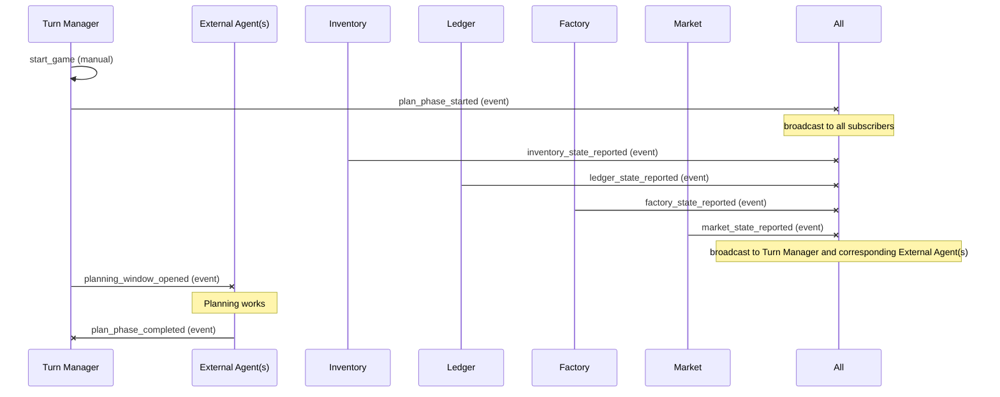
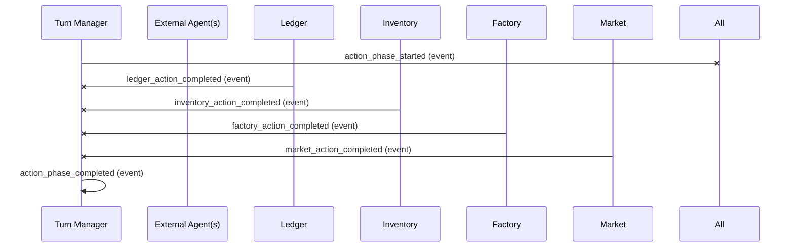
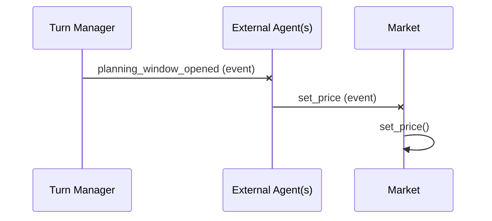
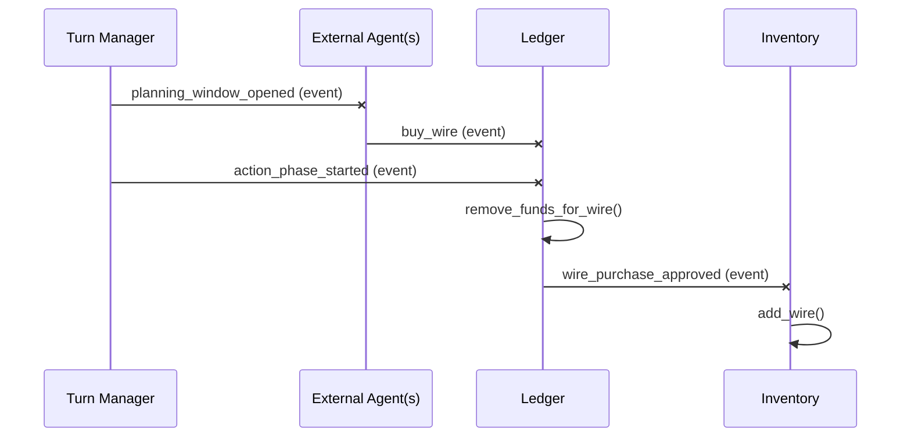
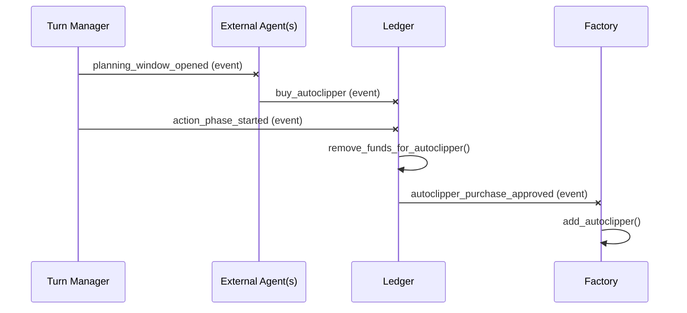
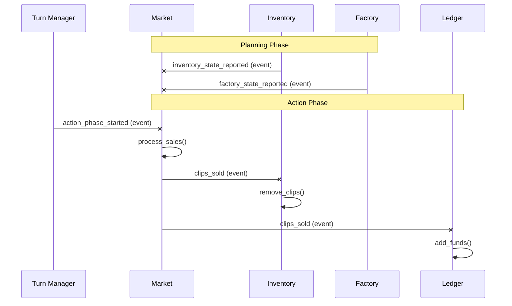
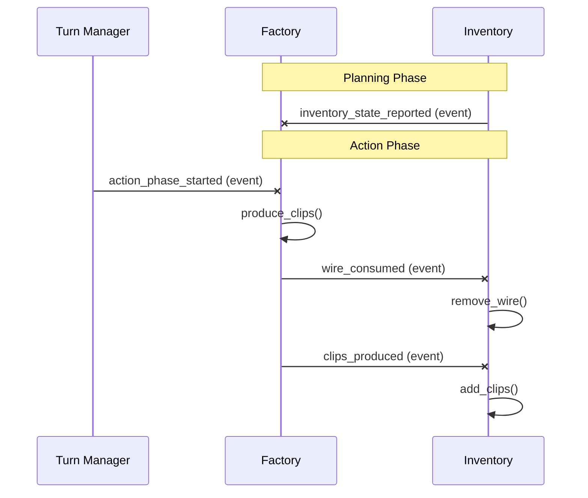

# Module Specifications

> This system is event‑driven; modules communicate exclusively via the event bus.
>
> **API contracts, state, and event payloads**: See [interfaces.md](./interfaces.md).

## Turn Manager
**Description**: Centralizes turn sequencing and time-step control.

**Business Logic**:
- Turn counter increments monotonically
- Plan phase must complete before action phase
- All state reports must be received before opening planning window
- Turn-based sequencing ensures events are processed sequentially; no race conditions

## Ledger
**Description**: Manages financial resources and transaction tracking

**Business Logic**:
- Cannot remove more funds than available (insufficient funds error)
- Purchase requests are queued during plan phase, processed during action phase
- Revenue from sales is credited during action phase

## Inventory
**Description**: Tracks physical resources and production output

**Business Logic**:
- Wire and clips cannot go negative (insufficient resources error)
- `total_clips` is cumulative and never decreases
- Production consumes wire at a fixed rate per clip

## Factory
**Description**: Manages automated production capacity and clip manufacturing

**Business Logic**:
- Each autoclipper produces `CLIPS_PER_AUTOCLIPPER` clips per turn
- Wire is consumed at action phase start (before production)
- If insufficient wire, produce partial clips: `wire // WIRE_PER_CLIP`

## Market
**Description**: Handles pricing logic, demand modeling, and sales transactions

**Business Logic**:
- Price must be a positive number
- Demand is calculated based on price elasticity (hidden parameters)
- Sales limited by unsold clips available
- Revenue = clips sold × price

## Event Bus
**Description**: Facilitates all inter‑module communication via a Redis-based implementation with thin adapter layer.

**Business Logic**:
- All events are published asynchronously
- Event handlers are invoked in subscription order
- Event log persists for debugging/replay

## Shared Utilities

**validate_action()** – Common validation logic for external actions only
- Validates external agent requests before they reach modules
- Checks resource availability, state constraints, and action feasibility
- Internal module-to-module events are trusted and not re-validated

## Module Flows

### Planning Flow

### Actions Flow

### Set Price Flow

### Wire Purchase Flow

### Autoclipper Purchase Flow

### Clip Sales Flow

### Production Flow

