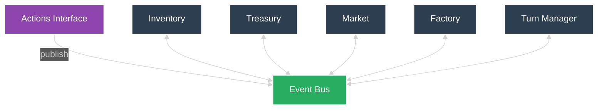

# Module Specifications

> This system is event‑driven; modules communicate exclusively via the event bus.

**Shared Internal API** – All modules use a common `validate_action(action)` service

## Inventory
**Description**: Tracks physical resources and production output

**State**: wire, unsold_clips, total_clips

**Public API**:
- add_wire() - Add wire to inventory
- remove_wire() - Remove wire for production
- add_clips() - Add clips to unsold_clips and total_clips
- remove_clips() - Remove clips from unsold_clips for sale
- get_state() - Return current inventory levels

**Responsibility**: Track raw materials, finished goods inventory, and lifetime production

## Treasury
**Description**: Manages financial resources and transaction tracking

**State**: money

**Public API**:
- add_funds() - Increase money from sales
- remove_funds() - Decrease money for purchases (validate funds)
- get_state() - Return current money balance 

**Responsibility**: Manage financial resources and transaction tracking

## Market
**Description**: Handles pricing logic, demand modeling, and sales transactions

**State**: price, demand_parameters (hidden)

**Public API**:
- set_price() - Update selling price
- get_state() - Return current price 
- process_sales() - Execute sale: add funds to Treasury, remove clips from Inventory

**Internal API**:
- update_demand(params) - Modify demand function parameters (Internal)
- calculate_sales() - Convert price/demand to actual clips sold (Internal)

**Responsibility**: Handle pricing logic, demand modeling, and sales transactions

## Factory
**Description**: Manages automated production capacity and clip manufacturing

**State**: auto_clippers

**Public API**:
- add_autoclipper() - Increase automated production capacity
- remove_autoclipper() - Decrease capacity (validate not below zero)
- produce_clips() - Generate clips from auto-clippers
- get_state() - Return auto_clipper count 

**Responsibility**: Manage automated production capacity and clip manufacturing

## Turn Manager
**Description**: Centralizes turn sequencing and time-step control

**State**: turn_counter

**Public API**:
- advance_turn() – Increment turn counter and trigger turn_start
- get_state() – Return current turn number

**Responsibility**: Coordinate turn progression and enforce turn ordering

## Event Bus
**Description**: Facilitates all inter‑module communication via a Redis-based implementation with thin adapter layer.

**State**: event log

**Functions**:
- publish() – validate and emit to subscribers
- subscribe() – register module for specific events
- get_event_log() – return full event history

**Responsibility**: Centralised, durable event handling for all modules.

**Implementation**: Thin adapter wraps Redis Pub/Sub/Streams, providing event validation, module-specific routing, and failure handling.

## Module Flows

## Turn Management

The Turn Manager runs two phases each turn: a **plan** phase that emits `plan_complete`, followed by an **action** phase that emits `auto_produce`.

| Module        | Event          | Function Mapping  |
| ------------- | -------------- | ----------------- |
| **Inventory** | `plan_phase`   | `get_state()`     |
| **Treasury**  | `plan_phase`   | `get_state()`     |
| **Market**    | `plan_phase`   | `get_state()`     |
| **Factory**   | `plan_phase`   | `get_state()`     |
| **Factory**   | `auto_produce` | `produce_clips()` |

| Module           | Function       | Emits Event                   |
| ---------------- | -------------- | ----------------------------- |
| **Turn Manager** | run_turn() | `plan_complete` → `auto_produce` |

## Module Subscriptions

| Module        | Event                | Function Mapping       |
| ------------- | -------------------- | ---------------------- |
| **Inventory** | `buy_wire`           | `add_wire()`           |
| **Inventory** | `wire_consumed`      | `remove_wire()`        |
| **Inventory** | `clips_produced`     | `add_clips()`          |
| **Inventory** | `clips_sold`         | `remove_clips()`       |
| **Treasury**  | `clips_sold`         | `add_funds()`          |
| **Treasury**  | `buy_wire`           | `remove_funds()`       |
| **Treasury**  | `buy_autoclipper`    | `remove_funds()`       |
| **Market**    | `clips_produced`     | `process_sales()`      |
| **Market**    | `set_new_price`      | `set_price()`          |
| **Factory**   | `wire_added`         | `produce_clips()`      |
| **Factory**   | `buy_autoclipper`    | `add_autoclipper()`    |
| **Factory**   | `remove_autoclipper` | `remove_autoclipper()` |

## Module Publications

| Module            | Function           | Emits Event                        |
| ----------------- | ------------------ | ---------------------------------- |
| Actions interface | Buy wire           | `buy_wire`                         |
| Actions interface | Update price       | `set_new_price`                    |
| Actions interface | Make clip          | `clips_produced`                   |
| Actions interface | Buy autoclipper    | `buy_autoclipper`                  |
| Actions interface | Remove autoclipper | `remove_autoclipper`               |
| Actions interface | Wait               | -                                  |
| **Inventory**     | `add_wire()`       | `wire_added`                       |
| **Market**        | `process_sales()`  | `clips_sold`                       |
| **Factory**       | `produce_clips()`  | `wire_consumed` → `clips_produced` |
| **Inventory**     | `get_state()`      | `inventory_state`                  |
| **Treasury**      | `get_state()`      | `treasury_state`                   |
| **Market**        | `get_state()`      | `market_state`                     |
| **Factory**       | `get_state()`      | `factory_state`                    |
